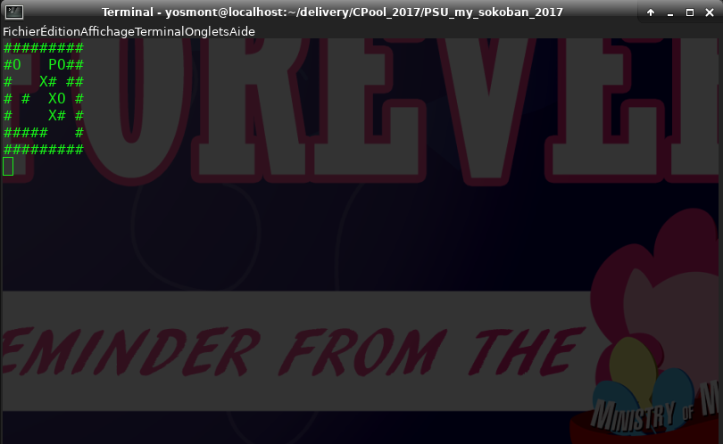
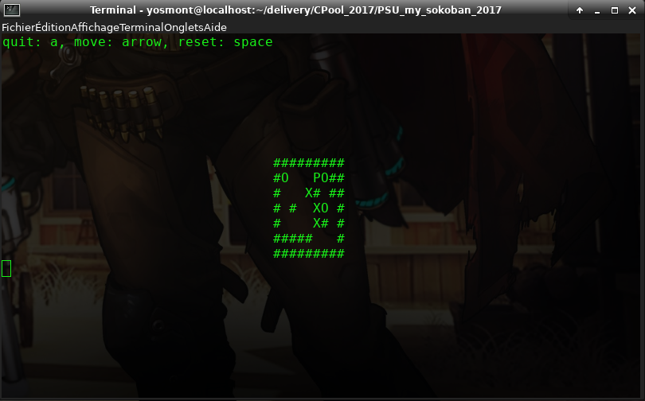

# my_sokoban
Epitech PSU_my_sokoban_2018 project

The goal was to implement sokoban game using ncurse librairy.

Usage: ./my_sokoban map_path
or: ./bonus_bin map_path

Maps should contains only:
  - X: movable blocks
  - O: blocks destination
  - P: player 
  - SPACE: empity case
  - \#: wall

How to play:
  - arrow: move the P
  - SPACEBAR: reset the current map
  - a: in bonus_bin that quit the game
  - You win when all O's are replaced by X's
  
a Exemple with map2:

The display in my_sokoban:

The display in bonus_bin:

